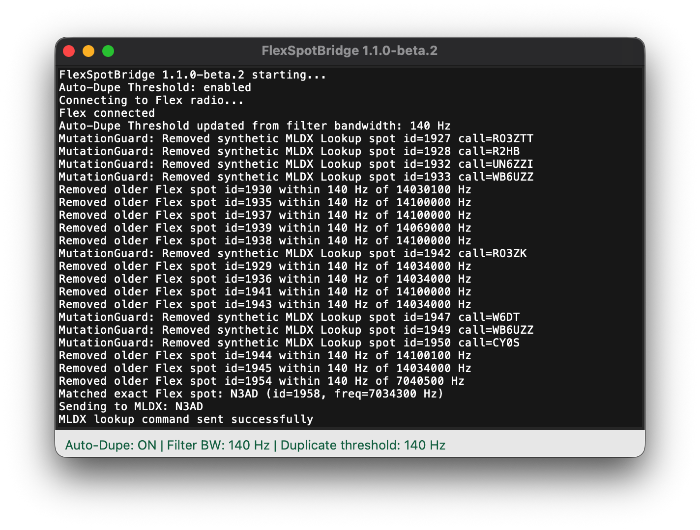
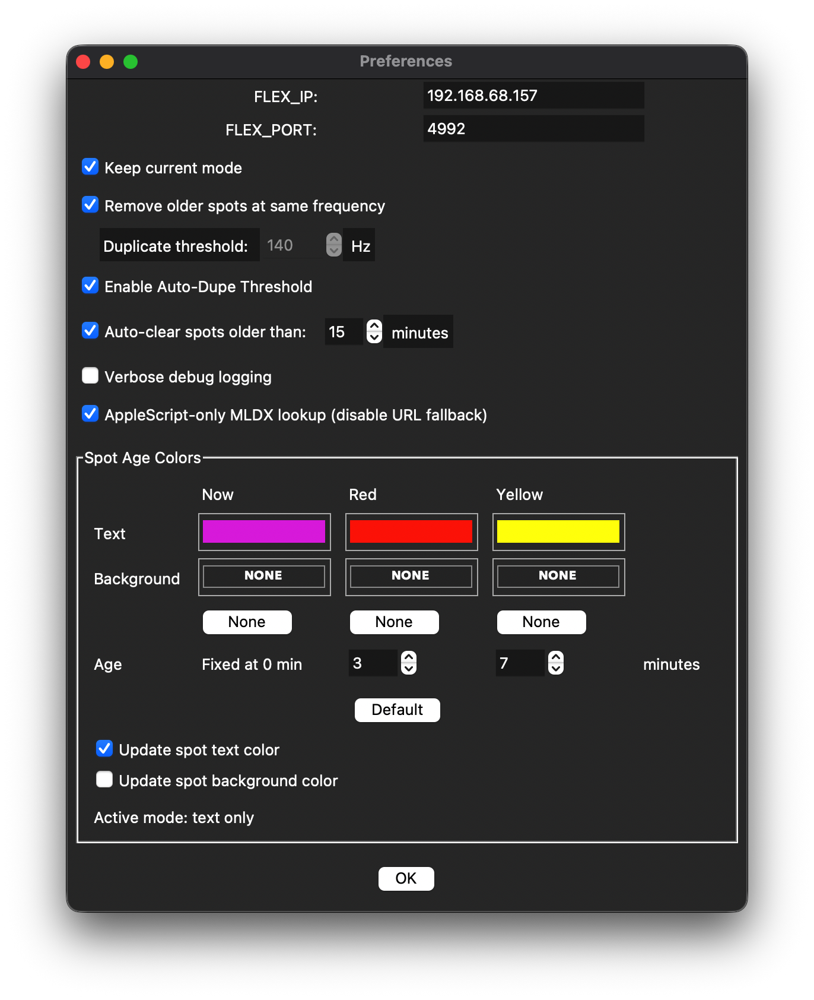

# FlexSpotBridge
## Mac SmartSDR to MacLoggerDX spot bridge

Current release: **1.1.1**

## Overview
The Windows version of SmartSDR has a feature missing from Mac SmartSDR.  When clicking on a panadapter spot in the Windows version, that spot information is sent out from the app for use by other applications.  That function is not present in Mac SmartSDR.

With this app, you can click on any spot that appears in your panadapter and tune your radio to that spot. FlexSpotBridge listens directly to the Flex spot stream, watches for VFO frequency changes, and matches only exact spot frequencies. When there is an exact match, the callsign is forwarded to MacLoggerDX (MLDX) and fills in the Call field.

Slowly tuning your VFO across spots can also trigger a MLDX lookup providing a handy method for seeing who's out there, simply by turning one knob.

FlexSpotBridge provides a GUI for monitoring (log output), settings, and clearing panadapter spots.

A ready-to-launch macOS version is available in the Releases section at: https://github.com/williamscody/FlexSpotBridge/releases

## Features
- Monitors FlexRadio spot and slice updates in real time
- Automatically sends matched callsigns to MacLoggerDX
- Optional automatic mode switching based on band-plan ranges
- Optional duplicate-spot cleanup using a configurable duplicate frequency threshold (Hz)
- Optional Auto-Dupe Threshold to mirror the current Flex filter bandwidth
- Optional automatic removal of old spots by age
- Custom spot colors and backgrounds, configurable based on age
- Clickable color swatches with native macOS color picker integration
- Independent toggles for updating spot text color and background color
- GUI window with live log output
- User-adjustable settings (radio IP/port and behavior toggles)
- Menu bar integration with Preferences and Clear All Spots (⌘L)

## System Requirements (my setup)
- macOS 12 or later (Apple Silicon or Intel)
- Python 3.9+ (tested with Python 3.14)
- FlexRadio 6000, 8000 or Aurora series (tested with Flex 8400)
- Mac SmartSDR app installed
- MacLoggerDX installed
- A spot source feeding spots into the Flex panadapter (for example MacLoggerDX internal cluster or SDC)
- py2app (for building the app)

## Settings Explained
- **FLEX_IP**: The IP address of your FlexRadio (e.g., `192.168.68.157`)
- **FLEX_PORT**: The FlexRadio TCP API port (default: `4992`)
- **Keep current mode** (checkbox): When enabled, FlexSpotBridge will not change the slice mode when a spot is matched. When disabled, FlexSpotBridge will allow mode change according to band-plan logic.
- **Remove older spots at same frequency** (checkbox): When enabled, FlexSpotBridge removes older Flex spots that are within the configured duplicate threshold and keeps only the newest one.
- **Contest mode (ignore newer spots near same frequency)** (checkbox): The opposite of Remove older spots. When enabled, FlexSpotBridge keeps the first/older spot at a runner frequency and ignores newer nearby spots (within threshold). This is useful for contest running where pounce callers cluster around one frequency.
- **Duplicate threshold** (spinbox): Frequency distance in Hz used to determine whether two spots are duplicates. Default is **25 Hz**. A new spot within this threshold of an existing spot is treated as a duplicate.
- **Auto-clear spots older than:** (checkbox + spinbox): When enabled, FlexSpotBridge automatically removes spots that are older than the specified number of minutes. Use the spinbox to adjust the age threshold from 1 to 99 minutes. The spinbox supports up/down arrow buttons, keyboard arrow keys, and direct numeric entry.
- **Verbose debug logging** (checkbox): When enabled, FlexSpotBridge prints detailed Flex processing logs. Leave this disabled for cleaner output and lower UI logging overhead.
- **Enable Auto-Dupe Threshold** (checkbox): When enabled, FlexSpotBridge uses the current Flex slice filter bandwidth (Hz) as the duplicate threshold and updates it automatically as bandwidth changes.
- **Spot Age Colors** section:
   - **Text row**: Choose text colors for the three age buckets (**Now**, **Red**, **Yellow**).
   - **Background row**: Choose background colors for the same three age buckets.
   - **None buttons** (background row): Set background for a bucket to **None** (Flex command uses `background_color=` with no value).
   - **Age row**: Configure Red and Yellow age thresholds in minutes (Now remains fixed at 0 minutes).
   - **Default button**: Resets age thresholds to Red=5 / Yellow=15, text colors to app defaults, and background colors to **None**.
   - **Update spot text color** and **Update spot background color**: Enable either feature independently or both together.

## Recommended Defaults for CW Operators
- Enable **Keep current mode** in Preferences so FlexSpotBridge does not switch out of CW on a matched spot; especially handy for contests.
- Keep **Remove older spots at same frequency** enabled so stale duplicates are automatically cleaned up.  Duplicate threshold should be 50-100Hz depending on CW traffic density.
- For runner-style contest operating, enable **Contest mode (ignore newer spots near same frequency)** so newer pounce spots near your run frequency are ignored and the original runner-frequency spot remains.
- Optionally enable **Auto-clear spots older than:** and set to 5-10 minutes to keep the panadapter clean of old spots.

## Usage
- Launch Mac SmartSDR
- Launch MacLoggerDX
- Ensure spots are being sent to your Flex panadapter from your preferred source.
- Launch FlexSpotBridge
- Use the **Preferences...** menu (⌘,) to enter your settings.
- In **Preferences...**, enable **Keep current mode** if you want to stay in your current mode (for example, to avoid switching out of CW).
- In **Preferences...**, enable **Remove older spots at same frequency** and set **Duplicate threshold** (Hz) to control how tightly nearby spots are considered duplicates.
- In **Preferences...**, enable **Contest mode (ignore newer spots near same frequency)** when you want the opposite duplicate behavior (keep older spots, ignore newer nearby spots).
- In **Preferences...**, optionally enable **Auto-clear spots older than:** and adjust the age threshold to automatically remove stale spots. A typical setting is 5-10 minutes.
- In **Preferences...**, use **Spot Age Colors** to configure age buckets and colors for spot text/background.
- Use background **None** buttons if you want no background color for a bucket.
- Use **Clear All Spots** (⌘L) to clear all spots from the panadapter.  FlexSpotBridge will only recognize spots that appear AFTER the program is launched.
- All log output appears in the main window.
- Note that MacLoggerDX will be in focus momentarily when a spot populates the call field.  Focus will quickly resume to the prior app after the spot is entered into MLDX.

## Optional Build Instructions 
1. Ensure you have Python 3.9+ and `py2app` installed:
   ```sh
   pip install py2app
   ```
2. Place `FlexSpotBridge.py`, `setup.py`, and `FlexSpotBridge.icns` (optional, for icon) in the same folder.
3. Build the app:
   ```sh
   python3 setup.py py2app
   ```
4. The app will be created at `dist/FlexSpotBridge.app`.
5. (Optional) Codesign the app for macOS:
   ```sh
   codesign --force --deep --sign - dist/FlexSpotBridge.app
   ```
6. Double-click the app to launch.

## Screenshots

### Main Window



### Preferences



## License
MIT License
